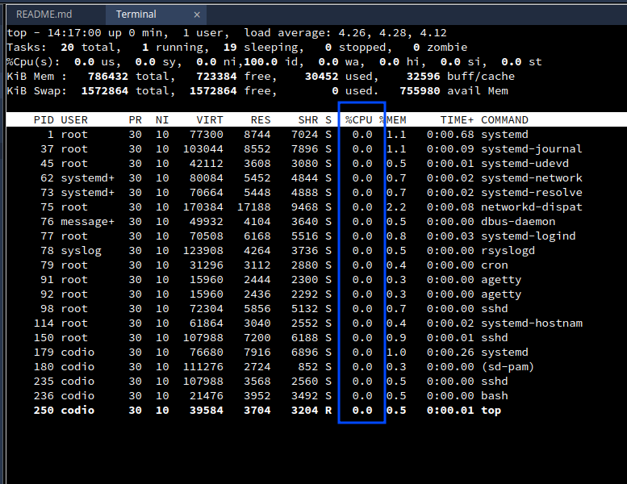
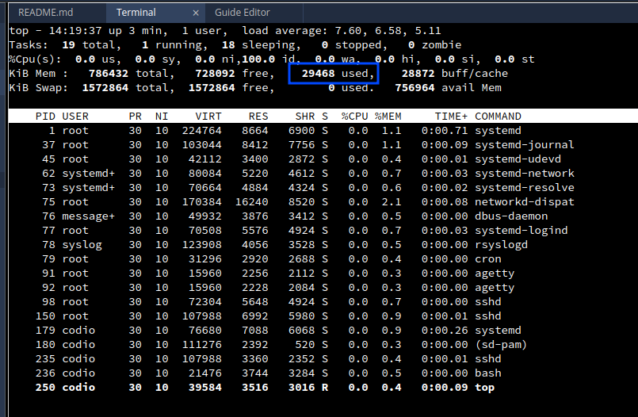
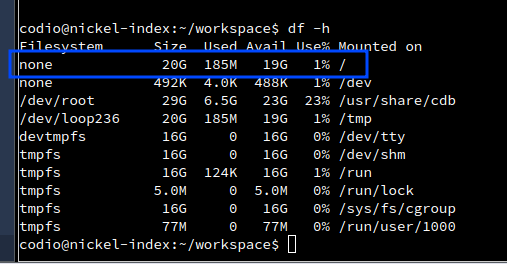

# Codio Box 

Codio boxes are virtual machines that are created for each assignment. They are created from a base image that is provided either configured by staff or the Codio team. 

## Codio "Certified" Boxes updates
Codio publishes updates to Codio certified stacks regularly, often it is just an update to the software packages, which is done with `apt update && apt upgrade` command.
If a more significant change is made, the Codio team will publish a new version of the stack and update provisioning scripts in https://github.com/codio/stacks/. All changes are backwards compatible, so you can continue to use your old course content with the new stack version.

If a breaking change is introduced, Codio will publish a new stack and will move the old one to deprecated. You can still use deprecated stacks, but it is recommended to update your course content to use the new stack when it is convenient. 

## CPU

All Codio Boxes are using shared CPU resources with fair balancing between users. There is no option to configure to have more or less CPU.

You can check CPU usage with the `top` command in the Terminal. You can monitor running processes and CPU utilization in real time. 100% CPU utilization means that your process is using only one vCPU core. Usually, long-running single-threaded processes won't affect the performance. If you have multithreaded long-running processes, we would recommend using VMs or limiting the amount of threads.

`htop` can also be installed into the box with the `sudo apt install htop` command. It provides more detailed information about CPU usage.

## Memory

Codio boxes can have different memory limits from 756Mb to 16Gb. You can check the memory limit of your box in the box settings. This is the hard limit. The `top` command will show you the memory usage of your processes.

Pay attention to the used column during the heaviest memory consumption by running software. If the used memory is close to the limit, you can expect performance degradation.

If you need more memory, you can use VMs.

## Disk space

The default box size is 5Gb. You can check the disk usage with the `df -h` command. It doesn't include stack size, which can be more than 5Gb.

It can be extended on request.

## Assignment size

`du -hs ./` can be used to check the assignment size. Keeping assignments smaller allows faster resource provisioning and is important for big online classes. As an example, see [npm](npm.md).

You can use `.assignmentignore` functionality to exclude non-required files or compiled versions of programs [excludingfiles](https://docs.codio.com/instructors/authoring/guides/excludingfiles.html#to-students)
